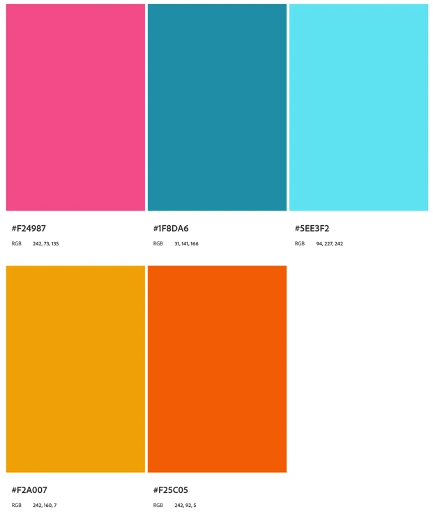
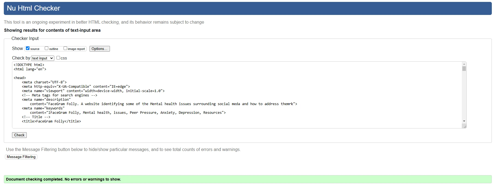
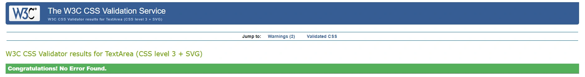
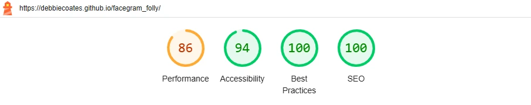
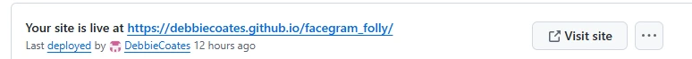

# FaceGram Folly

Picture of front and link to website

## OVERVIEW

  ## User Stories

## DESIGN

  ### Wireframe

  ### Colour Scheme

  I used a palette generator to select the main colors of my logo, and created a palette with five colors.

- Colour Palette

  

## FEATURES

  ### Navbar

  ### Hero Section

  ### Isssues

  ### Social media links in footer

## TESTING AND VALIDATION

When I tested the website I used a mix of different devices such as phones, tablets, and computers, as well as the virtual devices that come with developer tools. 

I also set a link to many friends and asked them to open and have a look and let me know if they could find any errors, they may be biased, but they all thought it looked OK and could see nothing wrong with it.

I also validated my HTML & CSS code on the W3C Site, and Lighhouse

### Validation Tools
- HTML Validation
  

- CSS Validation
  

- Lighthouse 
  

## DEPLOYMENT

This GitHub project was ceated using the code institute Template 

- Navigate to my repositories in github : https://github.com/DebbieCoates?tab=repositories
- select and Open the FaceGram_Folly repository.
- select Setttings
- select Pages
- make sure the page is set to deploy rom branch
- set the branch to Main
- save 
- After a few minutews the live project link is generated.

  

## CREDITS

- Image Converter

https://www.freeconvert.com/download

