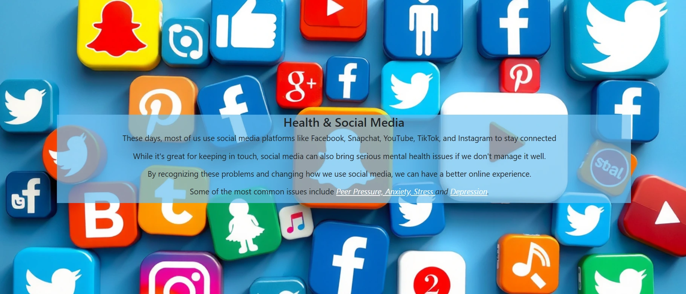
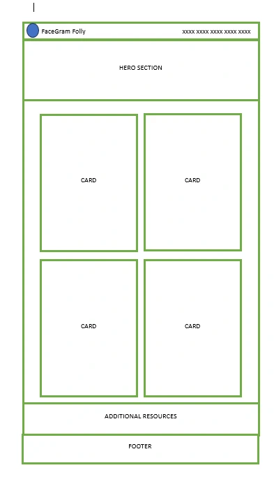
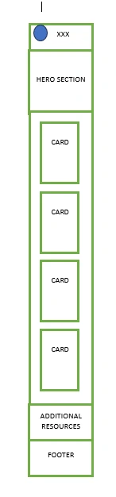
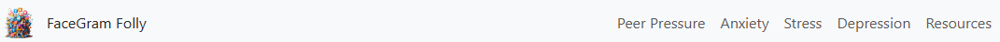
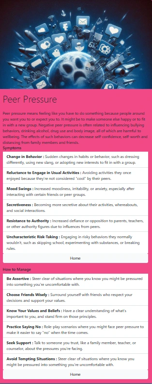
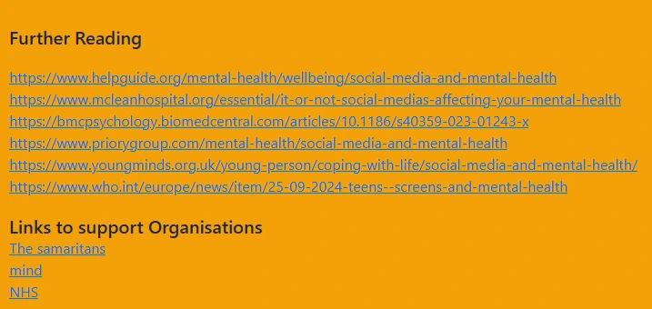

# FaceGram Folly

 

## OVERVIEW

n today’s digital age, social media has become an integral part of our lives. While these platforms offer incredible ways to connect, share, and engage with everyone aroound us, they also bring about significant mental health challenges. Issues like peer pressure, stress, anxiety, and depression are increasingly linked to our online interactions.

This website aims  to highlight some of these issues. The idea is to provide the user with a deeper understanding of how social media can impact your mental well-being and offer practical strategies to manage them.

  ## User Stories

- As a teenager struggling with peer pressure on social media, I want to learn strategies to resist negative influences, so I can maintain my self-confidence and well-being.

- As a college student experiencing stress due to constant social media notifications, I want to find ways to manage my online interactions, so I can focus better on my studies and personal life.

- As a young adult feeling anxiety from social media comparisons, I want to understand how to build a healthier relationship with these platforms, so I can improve my mental health.

- As a parent concerned about my child's exposure to social media, I want to access resources that explain the potential mental health impacts, so I can better support and guide my child.

- As a mental health advocate, I want to provide educational content about depression linked to social media use, so I can raise awareness and offer support to those in need.

- As an educator looking to address social media's impact on students, I want to find effective ways to incorporate mental health discussions into my curriculum, so I can foster a supportive learning environment.

## DESIGN

  ### Wireframe

  
  

  ### Colour Scheme

  I used a palette generator to select the main colors of my logo, and created a palette with five colors.

- Colour Palette

  

## FEATURES

  ### Navbar

  My navbar was based on the lesson learnt in the Love Running section of the course

  

  ### Hero Section

  I had trouble finding a hero sections, in the end I generated an image using Microsoft Designer and AI

  

  ### cards
  

  ### Additional Resources

    ### cards

  I used 4 cards from Bootstrap 5, I colored each card in one of the colors of my palette, but left the background white to emphasize the content.

  
  
  ### Social media links in footer

  I used the social media links and got the icons from font awsome

## TESTING AND VALIDATION

When I tested the website I used a mix of different devices such as phones, tablets, and computers, as well as the virtual devices that come with developer tools. 

I also set a link to many friends and asked them to open and have a look and let me know if they could find any errors, they may be biased, but they all thought it looked OK and could see nothing wrong with it.

I also validated my HTML & CSS code on the W3C Site, and Lighhouse

### Validation Tools
- HTML Validation
  

- CSS Validation
  

- Lighthouse 
  

## DEPLOYMENT

This GitHub project was ceated using the code institute Template 

- Navigate to my repositories in github : https://github.com/DebbieCoates?tab=repositories
- select and Open the FaceGram_Folly repository.
- select Setttings
- select Pages
- make sure the page is set to deploy rom branch
- set the branch to Main
- save 
- After a few minutews the live project link is generated.

  

 - Click on the link provided (above) to open the webpage

## CREDITS

https://www.helpguide.org/mental-health/wellbeing/social-media-and-mental-health
https://www.mcleanhospital.org/essential/it-or-not-social-medias-affecting-your-mental-health
https://bmcpsychology.biomedcentral.com/articles/10.1186/s40359-023-01243-x
https://www.priorygroup.com/mental-health/social-media-and-mental-health
https://www.youngminds.org.uk/young-person/coping-with-life/social-media-and-mental-health/
https://www.who.int/europe/news/item/25-09-2024-teens--screens-and-mental-health
https://www.nhs.uk/nhs-services/mental-health-services/
https://www.mind.org.uk/
https://www.samaritans.org/

- Code Institute  Tutors
  - Spencer 
  -  Amy

## RESOUCES USED

- Image Converter
    https://www.freeconvert.com/download

- Bootstrap5
   ttps://getbootstrap.com/

- used for editing content and help with building my page    
  ms Co-Pilot

- Font awsome for social Media icons
  https://kit.fontawesome.com/3ab97d3180.js

- Google fonts for the Quicksand font on my webpage

- friends and family for testing

- MS Word for drawing my wireframes

- Snippling tool for capturing my images and screenshots
